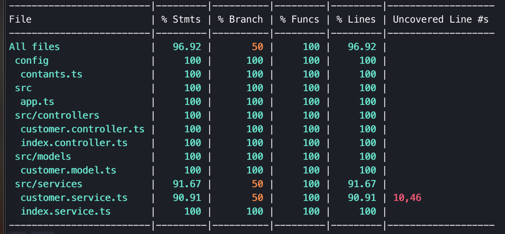

# IFCE - v1.0
> First of all thank you for the opportunity given by the IFCE to be able to show my knowledge.
>

## Table of contents
- [IFCE - v1.0](#ifce---v10)
  - [Table of contents](#table-of-contents)
  - [General info](#general-info)
  - [Screenshots](#screenshots)
  - [Technologies](#technologies)
  - [Setup](#setup)
  - [Commands](#commands)
  - [Features](#features)
  - [Status](#status)
  - [Inspiration](#inspiration)
  - [Contact](#contact)

## General info
The project aims to evaluate the CRUD - Create, Retrieve, Update and Delete - process

## Screenshots


## Technologies
* Node
* MongoDB

## Setup

> :warning: **Before install node packages**:
> * MongoDB must be installed, create a **"ifce"** DataBase and a **"customer"** collection;
> 
> * Check and configure the mongo access endpoint, editing the constants file, inside the config directory;
>
> * This project use node v14.4.0;

1 - Clone this repository
```console
~$ git clone <GIT_URL>
```

2 - Execute commands:
```console
~$ cd <project_name>
~$ npm install
~$ npm run serve
```

3 - Test access URL:
```console
~$ curl http://localhost:8080
```

## Commands
- **npm run clean** - Clean folder dist
```console
~$ npm run clean
```
- **npm run copy-deps** - Copy dependencies to dist folder
```console
~$ npm run copy-deps
```
- **npm run start** - Start server
```console
~$ npm run start
```
- **npm run serve.w** - Start server with watch mode
```console
~$ npm run serve.w
```
- **npm run build** - Prepare project to Cloud
```console
~$ npm run build
```
- **npm run test-dev** - Execute unit-test
```console
~$ npm run teste-dev
```
- **npm run test-dev-watch** - Execute unit-test with watch mode
```console
~$ npm run teste-dev-watch
```

## Features
List of features ready and TODOs for future development
* JWT

To-do list:
* Coverage test model mongoose
* Improve Customer validation logic

## Status
Project is: _finished_

## Inspiration
Project inspired by IFCE, based on test

## Contact
Created by [@douglaslira](mailto:douglas.lira.web@gmail.com) - feel free to contact me!